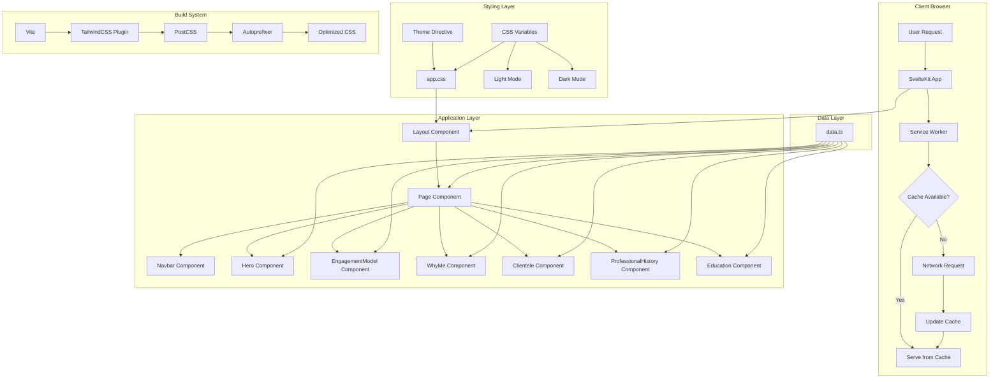

# Shiva Vilayanur - Personal Profile Website

A modern, responsive personal profile website for Shiva Vilayanur, Fractional CFO & Strategic Finance Partner. Built with SvelteKit, TypeScript, and TailwindCSS v4.1, featuring WCAG AAA accessibility compliance, bot protection, and offline support.

## Features

- **Fully Responsive**: Optimized for both desktop and mobile devices with adaptive layouts
- **Dark Mode Support**: Automatic theme switching with manual override, respecting system preferences
- **Offline Support**: Service worker caches all assets for offline access and improved performance
- **WCAG AAA Compliant**: Highest level of accessibility standards (7:1 contrast ratio for normal text, 4.5:1 for large text)
- **Bot Protection**: Comprehensive measures to block AI crawlers and search engine indexing
- **Performance Optimized**: Fast loading with local caching and optimized asset delivery
- **Modern Design**: Clean, professional interface using TailwindCSS v4.1 with CSS-based theme configuration
- **Type-Safe**: Full TypeScript support for enhanced developer experience

## Tech Stack

- **SvelteKit 2.50+** - Full-stack framework with file-based routing
- **Svelte 5.49+** - Latest version with runes ($state, $derived, $effect, $props)
- **TypeScript 5.9+** - Type safety and enhanced IDE support
- **TailwindCSS 4.1.18** - Utility-first CSS framework with CSS-based `@theme` configuration
- **Vite 7.3+** - Fast build tool and dev server
- **Service Worker** - Offline caching and PWA capabilities
- **PostCSS** - CSS processing with autoprefixer

## Architecture

### System Architecture Diagram



### Component Architecture

```
┌─────────────────────────────────────────────────────────────┐
│                      +layout.svelte                         │
│  (Root Layout: Theme Management, Global Styles, Meta Tags)  │
└───────────────────────────┬─────────────────────────────────┘
                            │
                            ▼
┌─────────────────────────────────────────────────────────────┐
│                        +page.svelte                         │
│                    (Main Page Container)                    │
└───────┬─────────────────────────────────────────────────────┘
        │
        ├──► Navbar Component (Floating, Responsive Navigation)
        │
        ├──► Hero Component (Profile, Statement, Contact Buttons)
        │
        ├──► EngagementModel Component (3 Models + Methodology)
        │
        ├──► WhyMe Component (3-Column Experience Cards)
        │
        ├──► Clientele Component (Carousel with Testimonials)
        │
        ├──► ProfessionalHistory Component (Timeline View)
        │
        └──► Education Component (Education & Certificates)
```

### Data Flow

```
data.ts (Centralized Content)
    │
    ├──► Profile Information
    ├──► Engagement Models
    ├──► Methodology Steps
    ├──► Why Me Sections
    ├──► Clientele Engagements
    ├──► Professional History
    └──► Education & Certificates
         │
         └──► Components (Read-only, Display)
```

## Getting Started

### Prerequisites

- **Node.js** 18+ (LTS recommended)
- **npm** or **yarn** package manager

### Installation

```bash
# Clone the repository
git clone <repository-url>

# Navigate to project directory
cd Shiva-Vilayanur

# Install dependencies
npm install
```

### Development

```bash
# Start development server
npm run dev

# The site will be available at http://localhost:5173
```

The development server includes Hot Module Replacement (HMR), fast refresh, source maps, and TypeScript type checking.

### Build & Preview

```bash
# Create production build
npm run build

# Preview production build locally
npm run preview

# Type checking
npm run check
```

Build output is in the `build/` directory, ready for static hosting.

## Project Structure

```
shiva-vilayanur/
├── src/
│   ├── lib/
│   │   ├── components/          # Reusable Svelte components
│   │   │   ├── Navbar.svelte    # Floating navigation bar
│   │   │   ├── Hero.svelte      # Hero section with profile
│   │   │   ├── EngagementModel.svelte  # Engagement models section
│   │   │   ├── WhyMe.svelte     # Why Me section
│   │   │   ├── Clientele.svelte # Client carousel
│   │   │   ├── ProfessionalHistory.svelte  # Timeline view
│   │   │   └── Education.svelte # Education section
│   │   └── data.ts              # Centralized content data
│   ├── routes/
│   │   ├── +layout.svelte       # Root layout (theme, meta)
│   │   ├── +layout.ts           # Prerender configuration
│   │   └── +page.svelte         # Home page (main content)
│   ├── app.css                  # Global styles & TailwindCSS @theme
│   ├── app.d.ts                 # TypeScript declarations
│   ├── app.html                 # HTML template
│   ├── hooks.server.ts          # Server hooks (headers, bot protection)
│   └── service-worker.ts        # Service worker for caching
├── static/                      # Static assets
│   ├── robots.txt               # Bot blocking rules
│   ├── .nojekyll                # Disable Jekyll processing
│   └── .htaccess                # Apache server rules (if supported)
├── .github/
│   └── workflows/
│       └── deploy.yml           # GitHub Pages deployment workflow
├── package.json                 # Project dependencies & scripts
├── svelte.config.js             # SvelteKit configuration
├── tailwind.config.ts           # TailwindCSS config (minimal for v4.1)
├── vite.config.ts              # Vite configuration
└── README.md                    # This file
```

## Content Sections

The website consists of six main content sections:

1. **Hero Section** - Profile photo placeholder, name, title, personal statement, and contact buttons (LinkedIn, Email)
2. **Engagement Model** - Three engagement models (Diagnostic Sprint, System Build, Interim Leadership) with methodology
3. **Why Me** - Three-column layout showcasing functional role, industry type, and work type experience
4. **Clientele** - Revolving carousel displaying client engagements with crisis, action, outcome, and testimonials
5. **Professional History** - Chronological timeline of work experience with accomplishments and investments
6. **Education** - Education credentials, certificates, and honors/awards

## Customization

### Updating Content

All content is centralized in `src/lib/data.ts`. Edit this file to update profile information, engagement models, client testimonials, professional history, education, and honors.

### Adding Profile Photo

1. Place your profile image in the `static/` directory
2. Update the `Hero` component in `src/routes/+page.svelte`:
   ```svelte
   <Hero imageSrc="/your-image.jpg" />
   ```

### Color Scheme & Theming

Colors are configured using TailwindCSS v4.1's `@theme` directive in `src/app.css`:

- **Light Mode**: Defined in `:root` CSS variables
- **Dark Mode**: Defined in `.dark` CSS variables
- **Theme Registration**: Colors registered with Tailwind via `@theme` block

To modify colors, update CSS variables in `src/app.css`. Colors are automatically available as Tailwind utilities (`bg-primary`, `text-primary`, etc.).

**TailwindCSS v4.1 Configuration:**
- Theme defined via `@theme` directive in CSS (not JavaScript config)
- `tailwind.config.ts` is minimal (only content paths, plugins, darkMode)
- `@tailwindcss/vite` plugin handles processing
- CSS variables enable dynamic theme switching

The color system ensures WCAG AAA compliance with 7:1 contrast ratio for normal text and 4.5:1 for large text.

## Bot and AI Crawler Protection

This website implements comprehensive measures to block AI crawlers and bots:

- **robots.txt**: Blocks all crawlers including GPTBot, ChatGPT-User, Google-Extended, Claude, Perplexity, and others
- **Meta Tags**: Multiple meta tags in HTML head to prevent indexing and archiving
- **HTTP Headers**: X-Robots-Tag headers (via `hooks.server.ts`)
- **User-Agent Blocking**: Server-side rules for Apache servers (`.htaccess`)

**Note**: While these measures provide strong protection, determined crawlers may still access content. For detailed information, see [BOT_PROTECTION.md](./BOT_PROTECTION.md).

## Accessibility

This website adheres to WCAG AAA standards:

- ✅ **Semantic HTML5** elements (`<nav>`, `<main>`, `<article>`, `<section>`)
- ✅ **ARIA labels** and roles where appropriate
- ✅ **Keyboard navigation** support throughout
- ✅ **Screen reader** compatibility
- ✅ **High contrast ratios** (7:1 normal, 4.5:1 large text)
- ✅ **Focus indicators** for all interactive elements
- ✅ **Reduced motion** support via `prefers-reduced-motion`
- ✅ **Proper heading hierarchy** (h1 → h2 → h3 → h4)

## Performance

Optimization strategies include:

- **Service Worker**: Caches assets for offline access
- **Code Splitting**: Automatic via SvelteKit
- **Lazy Loading**: Images use `loading="lazy"` attribute
- **CSS Optimization**: TailwindCSS purges unused styles
- **TypeScript**: Compile-time error checking
- **Vite**: Fast HMR and optimized builds

Production builds are optimized with minified CSS/JavaScript, tree-shaken dependencies, and optimized assets.

## Browser Support

- ✅ Chrome/Edge (latest 2 versions)
- ✅ Firefox (latest 2 versions)
- ✅ Safari (latest 2 versions)
- ✅ Mobile browsers (iOS Safari, Chrome Mobile)
- ✅ Progressive enhancement for older browsers

## Deployment

### GitHub Pages (Recommended)

This project is configured for GitHub Pages deployment with automatic CI/CD.

**Quick Setup:**

1. **Enable GitHub Pages**: Repository → Settings → Pages → Source: **GitHub Actions**
2. **Push to GitHub**: Commit and push your code to the `main` branch
3. **Monitor**: Watch the "Deploy to GitHub Pages" workflow in the Actions tab
4. **Access**: Site will be live at `https://your-username.github.io/repo-name`

**Important Notes:**
- If your repo is named `username.github.io`, update `svelte.config.js` to set `base: ''` (empty string)
- For other repo names, the base path is automatically configured
- The site includes a `404.html` fallback for client-side routing

**For detailed step-by-step instructions**, see [GITHUB_PAGES_SETUP.md](./GITHUB_PAGES_SETUP.md)

### Other Deployment Options

- **Vercel**: Change adapter to `@sveltejs/adapter-vercel`
- **Netlify**: Change adapter to `@sveltejs/adapter-netlify`
- **Cloudflare Pages**: Change adapter to `@sveltejs/adapter-cloudflare`
- **Node.js Server**: Change adapter to `@sveltejs/adapter-node`

### Environment Variables

No environment variables required for basic functionality. Add `.env` file if needed for API endpoints, analytics keys, or other configuration.

## Development Workflow

1. **Content Updates**: Edit `src/lib/data.ts`
2. **Component Changes**: Modify components in `src/lib/components/`
3. **Styling**: Update TailwindCSS classes or CSS variables in `src/app.css`
4. **Type Checking**: Run `npm run check` before committing
5. **Testing**: Test in both light and dark modes
6. **Build**: Run `npm run build` to verify production build

Code quality is ensured through TypeScript strict type checking and Svelte component validation.

## Troubleshooting

**Styles not applying**: Ensure `src/app.css` is imported in `+layout.svelte`

**Dark mode not working**: Check that `darkMode: 'class'` is set in `tailwind.config.ts`

**Type errors**: Run `npm run check` to see detailed error messages

**Build fails**: Clear `.svelte-kit` directory and rebuild

**GitHub Pages issues**: See [GITHUB_PAGES_SETUP.md](./GITHUB_PAGES_SETUP.md) troubleshooting section

## Additional Documentation

- **[GITHUB_PAGES_SETUP.md](./GITHUB_PAGES_SETUP.md)** - Detailed GitHub Pages deployment guide
- **[BOT_PROTECTION.md](./BOT_PROTECTION.md)** - Comprehensive bot protection documentation

## License

Private project for Shiva Vilayanur. All rights reserved.

## Credits

Built with:
- [SvelteKit](https://kit.svelte.dev/)
- [TailwindCSS](https://tailwindcss.com/)
- [Vite](https://vitejs.dev/)

---

For questions or issues, please contact the project maintainer.
